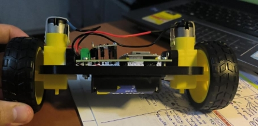

# PenduloInvertido_Iker

**PENDULO INVERTIDO**

Iker Antepazo Cancelas 

**Introducción:**
**\
` `En este documento recogeremos el proceso llevado a cabo para la creación y construcción de un robot llamado “péndulo invertido”, cuya función será de tratar de mantenerse en posición vertical con una tolerancia de ±5◦. 

El sistema debe compensar los empujones externos y volver a la posición vertical y debe ser capaz de poder iniciar su funcionamiento desde cualquier posición. 

**Metodología seguida**

1. **Buscar proyectos similares:** Investigar si ya existe un proyecto de un robot similar que sea funcional y esté documentado. Tanto en respositorios de github como en mi caso en videos de la plataforma YouTube y en la página “grabcad”. 
1. **Investigación general:** Como no existe ningún proyecto bien hecho y bien documentado que esté completo, procedemos a investigar el modus operandi que trataremos de llevar a cabo el proyecto partiendo de las ideas que sacamos de los sitios web antes mencionados. 
3. **Fijación de objetivos:** Es importante la fijación de ciertas metas para saber qué hardware necesitamos. Tanto es así para nuestro chasis como para nuestra placa PCB. 
3. **Selección del Hardware:** Una vez que sabemos las metas que queremos lograr conseguir con nuestro robot, tenemos que buscar el hardware necesario que se adapte a la perfección con lo que necesitaremos. 
3. **Diseño de la PCB:** Deberemos crear desde 0 una placa PCB diseñada por KiCad que contenga los elementos que emplearemos para el robot y las pistas con los mismos elementos conectados entre sí a través de los pines. 
3. **Diseño del Chasis:** Deberemos resolver dos problemáticas: tener el peso compensado y tener el centro de gravedad bajo. 
3. **Prueba de componentes por separado:** Verificamos que todo funcione por separado para luego soldar todo en la placa. 
3. **Montaje:** Montamos todos los componentes en el chasis para poder probar el robot al completo. 
3. **Programación inicial:** Hacemos un primer código que solo mantenga el robot estático en un mismo lugar. 
3. **Ajuste del PID:** Ajustamos los valores del PID para que el robot se mantenga estático. 

**Objetivos**

**Estabilidad Perpendicular al Suelo:**  

Garantizar que el robot sea capaz de mantenerse estable en la posición perpendicular al suelo (vertical). ✔ 

**Compensación de Empujones:**  

Desarrollar la capacidad del robot para compensar empujones y así evitar las caídas. ✔ 

**Arranque desde Cualquier Posición:** Lograr que el robot pueda iniciar su funcionamiento desde cualquier posición inicial. ✔ 

**Reducción de Posibilidades de Volcar:** Minimizar las posibilidades de que el robot vuelque y se caiga y asegurar que el robot no pueda volver a una posición no deseada. ✔ 

**Investigación** 

En relación con la búsqueda de otros proyectos de este estilo, he detectado una problemática: hay varios proyectos hechos con el mismo principio, pero nadie ha creado una documentación completa y descriptiva del proyecto, esto conlleva a un mayor gasto y empleo de tiempo en la búsqueda de los elementos hardware que debemos comprar y buscar, al igual que para el desarrollo de la pcb empleada y del diseño del chasis. En parte tuve suerte ya que gracias a toda la información recopilada por las páginas web y gracias al trabajo del compañero Daniel Acevedo, que fue el primero en hacer este proyecto y gracias al cual he sacado adelante este robot. Aunque hay esta escasez de información, he podido rescatar algo de información examinando videos. De ellos, he determinado el hardware que se necesita y el tipo de control para manejar el movimiento (PID). 

**Hardware** 

Para la selección del hardware, se buscó que el robot se hiciera con elementos básicos y comunes para que sea un robot de bajo costo y no dependa de cierta solvencia para poder realizarse, ya que como no hay verdaderamente un informe completo y descriptivo de todos los pasos a seguir podría atascarse el proyecto y ser necesarias varias pruebas como fue mi caso. 

**ESP32:**  

Para el microcontrolador, he empleado una ESP32. En concreto, se ha utilizado una ESP32 que ronda los 11€ en Amazon. He consultado un par de páginas web para informarme al respecto de esta placa, y a continuación dejaré todo lo necesario a conocer sobre esta placa:[ ESP32 ](https://es.wikipedia.org/wiki/ESP32). 

Este elemento es el encargado de mediante una conexión con cable USB al ordenador en la aplicación de Arduino, recibir los programas empleados. 

**MPU-6050:**  

Este sensor tiene incorporado un acelerómetro y un giroscopio, los cuales vamos a usar para medir la orientación e inclinación del robot, que como hemos comentado al principio del documento buscamos que pueda mantener la verticalidad sin sobrepasar los 5 grados de inclinación angular. Las fórmulas e información necesaria que he necesitado para usar este sensor están en esta página web:[ MPU6050 ](https://invensense.tdk.com/wp-content/uploads/2015/02/MPU-6000-Datasheet1.pdf). 

En el caso de este componente tuve serios problemas para encontrarlo ya que lo compré tres veces, pero me daba errores al probarlo hasta que acabé encontrando el idóneo. 

**Condensadores:**  

Empleé dos condensadores, uno de 0.1 uF y otro de 0.22uF:[ 0,1uF ](https://www.microjpm.com/products/capacitor-electrolitico-0-1uf-50v/)[,0,22uF ](https://www.microjpm.com/products/capacitor-electrolitico-50v-0-22uf/)

**Bloques terminales:** 

En este aspecto emplee tres bloques terminales que fueron los encargados de conectarse con los motores y la batería. A continuación, dejaré un enlace para el acceso a sus características:[ Bloques terminales ](https://es.rs-online.com/web/b/wurth-elektronik/conectores/bloques-terminales/?displayMonolithBrandPage=true)

**TB6612FNG:**  

El driver que he elegido es una solución más moderna que el común puente H; su precio es de menos de 2€ y nos permite controlar 2 motores simultáneamente y de manera independiente. He seleccionado este componente al igual que los demás gracias a la documentación presentada por Daniel Acevedo. Al igual que con el anterior sensor, la página de la que extraje toda la información la dejo en el siguiente enlace:[ TB6612FNG ](https://cdn.sparkfun.com/assets/0/1/b/b/3/TB6612FNG.pdf)

**Batería:** En este aspecto he empleado un portapilas de 4 pilas AA conectadas a los bornes de la placa.[ Portapilas AA ](https://www.amazon.es/CABLEPELADO-Portapilas-Interruptor-Soporte-Bater%C3%ADa/dp/B0B8VN7ZGZ/ref=sr_1_2_sspa?adgrpid=59855380287&dib=eyJ2IjoiMSJ9.0E4CYsIV8j7auTO14bG8hEXhwvBaReMFm0fjOPfJ3q8TX14t1DLaU0U6P-UUNUNhfeTnEdwRfe7vn24negRVgewhSJFmLo8vVjgERoEZWngb98hE1KTaQ585Hpb3RDzaZIQ5MAbn2fep-qAn-dRbsQS6pKlv9gUcdxg1BLczaTV1ES7gaFhVuajTCM7wP9TMQYEPgGFh99MIJ9aMC1JcNtHe7sM8db4In1UUd3a5C00RE-3oAFUU7VeJgylTTtVf4uSGRtyNm3ea7Xobz3k4uEAb4xq73gyJuEwPlg-UE9s.VIBVw3cz8qMJSTzGRXrtYivpHGLmTSzFw5oaB0C6DoU&dib_tag=se&hvadid=712269289876&hvdev=c&hvexpln=0&hvlocphy=9217726&hvnetw=g&hvocijid=354578821341335653--&hvqmt=b&hvrand=354578821341335653&hvtargid=kwd-368883696421&hydadcr=3445_2435935&keywords=portapila%2Baa&mcid=e65aab6caa613c229322b2821ad0fe45&qid=1749406825&sr=8-2-spons&sp_csd=d2lkZ2V0TmFtZT1zcF9hdGY&th=1)

**Motores y ruedas:**  

En este proyecto se han usado los comúnmente usados motores de DC con una reductora, la cual permite un fácil acople de una rueda que normalmente se vende con el propio motor.[ Motores y ruedas ](https://www.amazon.es/Gebildet-Motorreductor-Tracci%C3%B3n-Rob%C3%B3tico-Neum%C3%A1tico/dp/B08D39MFN1/ref=sr_1_1?__mk_es_ES=%C3%85M%C3%85%C5%BD%C3%95%C3%91&crid=1P1HI1AFTWELM&dib=eyJ2IjoiMSJ9.HRliVdVUooMfJ37_hB8r_pSJvEV5XNTqh8w4QUlMzPO8MLZGwhfzxdawege97K2pqwPePnT-DpDTJWyFgOl3We7KRaOzLvQuHXiuwfkcSI4S0dd1IR4lIPmYOkRhYtcfeCPd7Voi_DjQLjdWadgksw2yd01QWSmv9UIRkRiq65oQbt6oqpc5atx7QseQLc1OS11eH21BWngueKm1hwkIQ4lZicSd-Uhgugbw9jDTS-GnUuf1Kxd1msYV32x-stqU7vNEJ1KQYF6bO2tZLm_0Cfw12w8KJTQMtQ0VRDSMzLk.xFuda1aL2pKo9rfUjou-0chu3DpncL0IzS-mdohaGTc&dib_tag=se&keywords=ruedas%2Brobot&qid=1749406908&sprefix=ruedas%2Brobot%2Caps%2C167&sr=8-1&th=1) 

**Regulador de voltaje:** 

En este aspecto emplee un regulador de voltaje LM7805 que me servirá para 

controlar el flujo de voltaje en el circuito. Aquí dejaré una datasheet para  comprender su funcionamiento y características:[ Regulador de voltaje ](https://www.alldatasheet.com/view.jsp?Searchword=Lm7805%20datasheet&gad_source=1&gad_campaignid=1421144141&gclid=CjwKCAjw6ZTCBhBOEiwAqfwJd2oRRv3XeQ9ZCx_5SY_imFatNLl_RGne5QrWJkQlLroW2QNfGPGR_hoC_5wQAvD_BwE)

**PCB** 

He diseñado una placa PCB capaz de emplear todos los elementos antes  

mencionados y que estén conectados entre sí de forma que nos funcione todo a   la perfección. En este aspecto debemos buscar la obtención de una placa que   no tenga mucho lío de pistas para ver la función de cada una de ellas a la   perfección, buscamos una claridad importante para en caso de alguna duda  presentada a la hora de la soldadura de los elementos con el estañador saber de   qué pin a qué otro pin va cada pista. 

Asímismo es de vital importancia el contar con una placa de pocas  

dismensiones para así facilitarnos el proceso de creación del chasis, porque no   queremos un robot muy grande, con lo cual esto será muy importante. 

**Chasis**

He diseñado 2 tipos de chasis para el robot el primero fue para tantear más o menos, y con el segundo, gracias a los consejos de Daniel he logrado hacer funcionar el robot ya que cumple correctamente con los requisitos del centro del centro de gravedad que estaba muy centrado y a una altura baja, lo que proporcionaba una gran estabilidad.  

Lo importante a tener en cuenta para el desarrollo del chasis son los siguientes dos requisitos: 

**Centro de gravedad:** Es determinante que el centro de gravedad del robot sea el más bajo posible. Si el peso está muy elevado respecto al suelo, se hará prácticamente imposible que el robot sea capaz de mantenerse derecho. 

**Peso centrado:** Al igual que el centro de gravedad bajo, es decisivo que el peso del robot esté centrado en el eje de las ruedas, lo que hará que, combinado con el apartado anterior, el robot debería mantenerse en la posición que queremos sin necesidad de que el robot esté encendido. Cuanto más estable sea el robot gracias al diseño del chasis, más sencillo nos será ajustar el PID hasta lograr que el robot funcione correctamente. Ahora voy a explicar los problemas de mis distintos chasis hasta el momento en que fui capaz de hacer que el robot funcionara. 

***Primer chasis:*** 

Después de corregir los errores de los dos chasis mencionados por Daniel Acevedo en su documentación, logré hacer un chasis con el que robot funcionara. En este caso, el centro de gravedad estaba muy centrado y a una altura baja, lo que proporcionaba una gran estabilidad incluso cuando el robot estaba apagado. Pero no se adaptaba completamente con mis necesidades debido al uso de los motores antes mencionados. 

Este primer chasis lo he desarrollado a través de la página web de ”onshape” lo que me permitió diseñar incluso el portapilas pero se me hizo muy duro y difícil terminar con este proceso con lo cual para el segundo chasis me pasé a FreeCad. 

***Segundo chasis:*** 

Este segundo chasis lo he diseñado con la ayuda de FreeCad, le he agregado   calculando las dimensiones de la placa PCB unos agujeros para permitirnos   atornillar la placa al chasis con tuercas y tornillos asegurándonos así la fijación   de esta. Al igual que esta novedad también le he agregado unas elevaciones en   los laterales de la placa para poder atornillar nuestros motores en posición    vertical permitiéndonos de este modo emplear los motores tradicionales antes  mencionados. 

Este fue el diseño final del chasis ya que se adaptaba a la perfección con lo  

deseado, con lo cual generamos el archivo .gcode para enviar a la impresora 3d.   Esto se hizo gracias a la aplicación Ultimaker Cura. 

A partir de aquí la impresión duró 4 horas aproximadamente, pero tuve  bastantes problemas con las impresoras del centro debido a que se quedaba atascado el material y había ciertos errores de calibración en la impresora 

empleada. 

**Prueba de componentes por separado** 

**MPU-6050:** 

Realizamos una primera prueba para verificar que el sensor funcione 

Como vemos que el sensor nos proporciona medidas coherentes, procedemos  a calibrar el sensor en la posición en la que estará midiendo. 

Finalmente, probamos el código que utilizaremos para medir el ángulo de 

inclinación del robot. 

TB6612FNG: 

Al igual que los códigos del sensor anterior, los he modificado antes de subirlos   a la ESP32, ajustando los pines para que sean compatibles con la ESP32: 

**Montaje** 

El montaje es muy simple, debemos conectar todo de la manera en la que hemos diseñado la PCB. Además de las conexiones de los sensores, 

necesitamos alimentar los motores y la ESP32.  Ambos trabajan a voltajes   distintos, por lo que requerimos un regulador de voltaje. Los motores los he   alimentado a 9V, y la ESP32 se alimenta a 5V en el pin 5V.  

**Ajuste del PID** 

Para poder ajustar el PID, es necesario comprender la función de cada una de   las tres componentes de este sistema de control. 

**Empezar desde 0:** 

Es crucial comenzar con todos los valores desde 0 y ajustar los valores de 

manera ordenada e independiente. 

**Orden de calibración:** 

Se recomienda iniciar ajustando los valores de Kp hasta lograr que el robot sea   capaz de levantarse desde el suelo. Una vez logrado esto, se anota el valor optimo y se establece la variable a 0. 

Luego, se ajusta Kd, buscando un valor en el cual el robot no oscile  exageradamente y casi se mantenga en la posición deseada. 

En el tercer paso, se restablece Kp al valor anotado anteriormente y se deja Kd   en el valor optimo encontrado. En este punto, Ki aun se mantiene en 0, pero primero se verifica que el robot casi se mantenga en la posición 

deseada. 

Finalmente, se ajusta Ki. Esta componente solo ayuda al robot a alcanzar la posición precisa, si las otras dos componentes no se han ajustado 

correctamente, Ki no cambiara radicalmente el comportamiento del robot. En   resumen, Kp y Ki son las más importantes. 

**Valores pequeños:** 

Los valores del PID dependen en gran medida de la construcción del robot. Es   importante tener en cuenta que cuanto mayores sean los valores, más agresivo   será el movimiento del robot. Se 

recomienda comenzar con valores menores a 1 y realizar incrementos pequeños   para evitar que 

el robot se mueva bruscamente. 

**Programación inicial** 

Al combinar los códigos previamente agregados a esta documentación con un   control PID, podemos lograr que el robot funcione. Sin embargo, es necesario 

ajustar los valores del PID para que se adapten a nuestro caso específico. 

En este punto fue donde en mi caso el robot dejó de funcionar, esto debido a que   debe haber alguna conexión en la placa que hace que la ESP32 se quede 

congelada y no acabe de enviar el programa el componente pertinente. Trataré   de solucionar este problema más adelante por mi cuenta, pero debido al cierre   de actas cercano aquí es dónde me he quedado. 

El código que deberíamos emplear sería: 

